 

 

## About me

Hey, I'm Alchemy. I work on Windows performance tuning for gaming and low latency systems.

I follow serious, well-documented methods and my own custom tools to capture and analyze performance, so what I publish is measured, not guessed.
